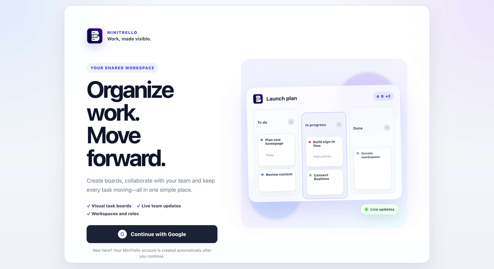
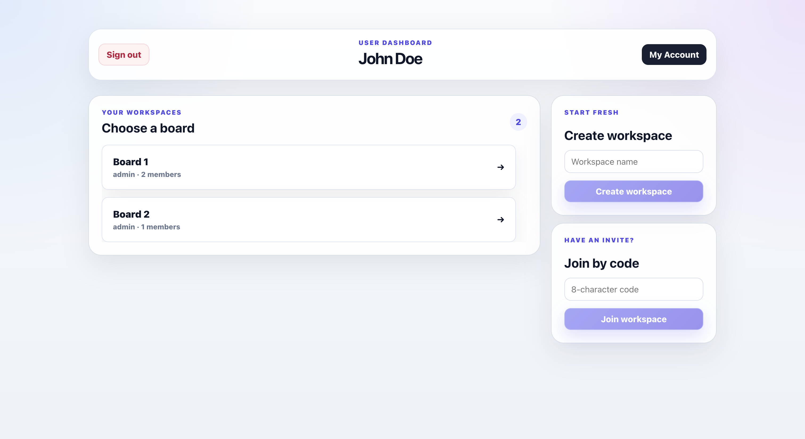
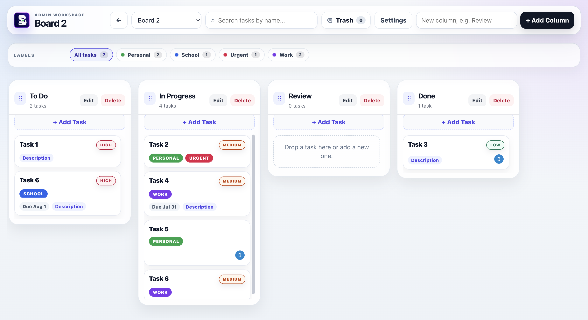

# MiniTrello

MiniTrello is a fast, multi-workspace Kanban application built on React and Supabase. Designed for real-time collaboration, it supports Google OAuth, flexible workspace roles, and zero-lag board synchronization using PostgreSQL and Supabase Realtime.

Production: [https://mini-trello-bice.vercel.app](https://mini-trello-bice.vercel.app)

## Why I Built This

I built MiniTrello out of a simple need during my school projects and my hackathons when working with my teammates. While Trello is clean, it lacks simple essentials like multi-member task assignments and flexible workspace roles. Enterprise tools like Jira have those features, but their heavy, slow interfaces drag team momentum down.

MiniTrello gives you the best of both worlds. It’s super fast, updates instantly for everyone on the team, and gives you just the right tools like multi-person assignments, live updates, and simple account management without any of the clutter.

## Main features

- Google sign-in through Supabase Auth
- Automatic MiniTrello profile creation after the first sign-in
- Multiple workspaces with join codes
- Admin-controlled workspace renaming with live updates
- Workspace `admin` and `member` roles
- Add members by Gmail
- Leave a workspace without deleting its board; admins transfer control first
- Persistent member-left activity notifications for workspace admins
- Change login Gmail without changing the MiniTrello UUID, workspaces or roles
- Delete the current account safely without opening the Supabase dashboard
- Dynamic and draggable columns
- Draggable tasks with desktop and touch support
- Task search, priority, due date and multiple labels
- Assign each task to one or more real workspace members
- Trash, restore and permanent deletion
- Supabase Realtime updates between browsers and devices
- Responsive login, dashboard and board interfaces

## Demo
This project is live at [mini-trello-bice.vercel.app](https://mini-trello-bice.vercel.app/)

Screenshot:







## Technology

| Layer | Technology |
|---|---|
| Frontend | React 19 and Vite 6 |
| Authentication | Supabase Auth with Google OAuth |
| Database | Supabase PostgreSQL |
| Authorization | PostgreSQL RLS and authenticated RPC functions |
| Live updates | Supabase Realtime Postgres Changes |
| Hosting | Vercel |

## Repository structure

```text
src/
  AuthContext.jsx              Supabase session and Google login
  RootApp.jsx                  Routing, workspace loading and Realtime channels
  components/                  Login, dashboard, account and board UI
  services/workspaceService.js Authenticated database RPC calls
  supabaseClient.js            Browser Supabase client
supabase/
  schema.sql                   Complete destructive development schema
  functions/delete-account/   Authenticated server-side account deletion
docs/
  AUTH_SUPER_ADMIN.md          Auth, identity linking and Super Admin details
  SYSTEM_DESIGN.md             Application architecture
  data_model.md                Database model
  BUG_FIX_LOG.md               Bug fixes and product change history
vercel.json                    SPA route rewrite
```

## Set Up

To set up and run this project locally or deploy the project, please refer to docs/set_up.md.


## Documentation

- [Authentication and Super Admin](docs/AUTH_SUPER_ADMIN.md)
- [System design](docs/SYSTEM_DESIGN.md)
- [Data model](docs/data_model.md)
- [Knowledge transfer](docs/knowledge_transfer.md)
- [Bug and change log](docs/BUG_FIX_LOG.md)
- [Set up](docs/set_up.md)
